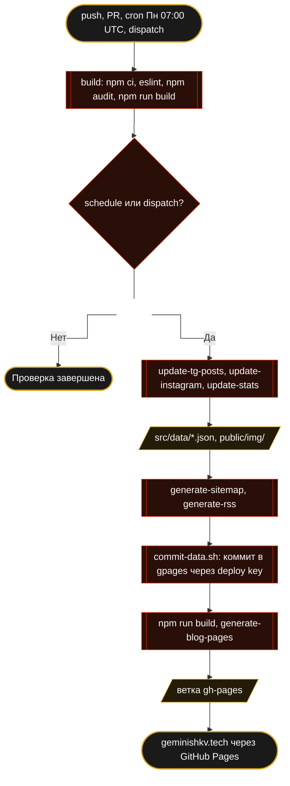

<div align="center">
<a href="https://geminishkv.tech">

</a>
</div>

<div align="center">


</div>

Персональный портфолио-лендинг на React 18 с anime.js анимациями, двуязычным блогом (RU/EN), design system на CSS-токенах и автоматическим обновлением контента через GitHub Actions.

**Что делает:**

* **SplashScreen** — Canvas2D shader (brand red→gold) + SVG pretitle
* **Holographic Monitor** — CSS floating monitor с glow + Python typewriter
* **Typewriter** — DOS-стиль набор заголовка с glitch-эффектом по символам
* **Экраны** — на десктопе главная из восьми экранов в высоту окна с нативной привязкой CSS scroll-snap: один щелчок колеса — один экран, клавиши, свайп, точки и `#`-ссылки работают средствами браузера, контент подгоняется под высоту окна; на телефонах тот же порядок одним документом
* **Blog** — 350+ постов из Telegram с переводом RU→EN: на главной последний крупно + компактный список; `/blog/` — фильтры по темам, поиск, избранный пост, «показать ещё», статические страницы для поисковиков
* **Instagram** — превью 8 последних постов и ссылка на профиль
* **SEO** — JSON-LD, OG, Twitter Card, sitemap (≈760 URL), RSS (RU+EN), llms.txt, hreflang
* **Security** — CSP через `<meta>` без `'unsafe-inline'` в `script-src`, self-hosted шрифты, аналитика только после согласия
* **Privacy** — политика конфиденциальности (ФЗ-152), баннер согласия на аналитику (Метрика и Plausible грузятся только после «Принять»), уведомление об использовании материалов — раздел 10 политики

Сайт: **[geminishkv.tech](https://geminishkv.tech)**

<div align="center"><h3>Sic Parvis Magna</h3></div>

***

### Стек технологий

| Слой | Технология |
|------|-----------|
| UI-фреймворк | React 18 (CRA) |
| Анимации | anime.js 3.2.2 + IntersectionObserver + CSS keyframes |
| Стили | CSS Design System (85 токенов, custom properties, clamp, clip-path) |
| i18n | LangContext (RU/EN) — localStorage, без сторонних библиотек |
| Деплой | `scripts/deploy.js` (git) → GitHub Pages, ветка `gh-pages` |
| Домен | geminishkv.tech (reg.ru + GitHub Pages custom domain) |
| SEO | JSON-LD, OG, Twitter Card, hreflang, sitemap.xml (≈760 URL), RSS, llms.txt |
| Security | CSP meta-tag, X-Frame-Options, Referrer-Policy, Permissions-Policy |
| CI/CD | GitHub Actions — `ci.yml`: lint + audit + build на push, weekly update + deploy по cron |

***

### Функциональность

* **SplashScreen** — Canvas2D shader (бренд-цвета red→gold) + SVG pretitle, reshow раз в 30 мин
* **Holographic Monitor** — CSS floating monitor с glow-рамкой: blinker → progress bar → Python typewriter → UwU
* **Typewriter** — glitch-эффект: рандомные символы перед каждой буквой, DOS-стиль
* **BrandColumn** — каскадная анимация: materialize → diamond rotate → pulse ring → slide-up (синхронизация с Mac)
* **GlitchLabel** — заголовки секций печатаются с glitch при скролле (IntersectionObserver)
* **Badges marquee** — бесконечный скролл логотипов достижений
* **CookieBanner** — компактная карточка согласия на аналитику (ФЗ-152) внизу справа; выбор хранится 180 дней, сменить — `/#consent`
* **Stats** — 5 ключевых метрик с анимацией count-up при входе на экран
* **Projects** — все репозитории плиткой 3×2 (stars, forks, язык), без пейджера
* **Blog** — 350+ постов из Telegram `appsecta`; на главной последний пост крупно + 5 компактных, фильтры по тегам, карточка канала с подписчиками; `/blog/` с фильтрами по темам, поиском, избранным постом и «показать ещё» (статические страницы по 15 остаются для поисковиков); статические SEO-страницы `/blog/{id}/` (RU) и `/blog/en/{id}/` (EN); переключатель RU/EN
* **Videos** — YouTube-карточки: подкаст по безопасной разработке, интервью BISA
* **Experience** — карьера как конвейер: 7 узлов с логотипами на трубе red→gold и кольцами, текущий горит; наведение или тап по узлу показывает результаты этапа под трубой; вертикальная труба на телефонах
* **Hero** — позиционирующая строка, описание списком 2×2, чёрные пилюли логотипов, команды-ссылки в терминале после интро (`ls projects`, `tail blog`, `skills`, `contact`), кнопки скачивания с реальным прогрессом загрузки, водяной логотип и сетка на фоне; полоса «Сейчас» с живыми цифрами канала
* **Tools** — домены как чипы трёх уровней (ядро / сильное / рабочее), стек из 8 панелей с чипами инструментов; справа дипломы и сертификаты по резюме (первые четыре, остальные по кнопке)
* **Section headers** — единый `SectionHead`: eyebrow `// имя`, заголовок с glitch-typewriter, подзаголовок, действие справа
* **Instagram** — 8 последних постов (обложки кешируются в `public/img/instagram/`), ссылка на профиль
* **Contacts** — экран «Давай поговорим»: Telegram и копирование email с тостом, NFC-визитка с наклоном при наведении, ссылки профиля и контента; футер на нём без дублирующих колонок
* **Nav** — i18n (RU/EN), SVG бургер с морфингом, LangSwitch toggle, прогресс-линия (по экрану на десктопе, по скроллу на телефоне), активная пилюля секции (`aria-current`)
* **Кнопки** — PackageBtn (hacker glitch, единый стиль всех ссылок под лентой логотипов), ContactBtn (pill + status dot в цветах бренда), DownloadBtn (заливка круга = реальный прогресс `fetch`, fallback по времени без CORS), SocialIcons (slide-in SVG)
* **Responsive** — экраны на ≥901px (планшет-ландшафт 901–1300px плотнее, масштаб не ниже 0,8, экраны отступают от закреплённого меню на 104px), документ на телефонах; ультравайд ≥2000px растит контент до 1,3; заголовок hero масштабируется от колонки (`cqi`); проверено Playwright на 1024/1280/1440/1920/2560/3440 от 390 до 2946 px
* **A11y** — skip-link, красное кольцо `:focus-visible`, `<main>` landmark, тап-таргеты 44 px на телефонах, `prefers-reduced-motion`
* **prefers-reduced-motion** — все анимации отключаются по системной настройке
* **404** — дино-раннер в стиле Chrome, стилизован под бренд
* **Privacy** — `/privacy/` статическая страница (ФЗ-152, cookie, права пользователя)

***

### Design System

85 CSS-токенов в `:root` (App.css), только используемые:

| Категория | Токенов | Примеры |
|-----------|---------|---------|
| Surfaces & Borders | 10 | `--surface-card`, `--border-default` |
| Text grays | 8 | `--text-muted`, `--text-secondary`, `--text-pale` |
| Spacing (4px grid) | 9 | `--space-1` (4px) → `--space-9` (64px) |
| Typography | 8+ | `--text-xs` → `--text-3xl`, `--leading-*`, `--font-bold` |
| Radius | 3 | `--radius-sm` (3px) → `--radius-lg` (6px) |
| Z-index | 5 | `--z-sticky` (100) → `--z-consent` (9000) |
| Red alpha | 10 | `--color-red-a06` → `--color-red-a50` |
| Gold alpha | 7 | `--color-gold-a06` → `--color-gold-a60` |
| Black/White alpha | 5 | `--color-black-a30` → `--color-black-a50`, `--color-white-a*` |
| Nav backgrounds | 2 | `--nav-bg`, `--nav-bg-solid` |
| Motion | 7 | `--ease-out`, `--dur-fast` (160ms) / `--dur-ui` (220ms) / `--dur-reveal` (600ms), `--duration-normal/slow` |

***

### Security

GitHub Pages не даёт настраивать заголовки ответа, поэтому политика задана `<meta http-equiv>` в `public/index.html`. Браузер применяет из них только CSP: остальных директив нет в списке pragma HTML, и как `<meta>` они не действуют.

| Политика | Значение | Действует |
|----------|----------|-----------|
| Content-Security-Policy | `default-src 'self'`; `script-src` без `'unsafe-inline'` (`INLINE_RUNTIME_CHUNK=false`), `font-src 'self'`, аналитика только после согласия | ✅ через `<meta>`, кроме `frame-ancestors` |
| X-Content-Type-Options | `nosniff` | ❌ нужен заголовок |
| Referrer-Policy | `strict-origin-when-cross-origin` | ❌ нужен заголовок или `<meta name="referrer">` |
| Permissions-Policy | `camera=(), microphone=(), geolocation=(), payment=()` | ❌ нужен заголовок |
| X-Frame-Options | не задан | ❌ нужен заголовок |

Настоящие заголовки и HSTS появятся с переездом на хостинг с управлением заголовками: ветка `feat/deploy-regru`, `public/.htaccess`.

***

### CI/CD

| Workflow | Триггер | Секреты | Действие |
|----------|---------|---------|----------|
| `ci.yml` — **build** | push / PR → `gpages` | `YM_ID` | `npm ci` → `eslint src/ --max-warnings 0` → `npm audit --omit=dev --audit-level=high` → `npm run build` |
| `ci.yml` — **update-and-deploy** | cron Пн 07:00 UTC / manual, после **build** | `YM_ID`, `DATA_PUSH_SSH_KEY` | TG + Instagram + stats → sitemap + RSS → коммит данных в `gpages` через deploy key → build → blog pages → deploy `gh-pages` → ping Yandex |
| `pages-build-deployment` | push в `gh-pages` | — | GitHub Pages публикует `geminishkv.tech` |
| Dependabot | Пн | — | PR на пины actions и npm minor/patch; мажоры, которые не берёт CRA 5, игнорируются |

Ручной запуск: `workflow_dispatch` с опцией `skip_data`.

Шаги данных не роняют деплой: Telegram при недоступном источнике оставляет коммитнутые данные, статистика пропускает репозиторий с ошибкой, Instagram и коммит данных помечены `continue-on-error`, а сбой коммита красит прогон уже после деплоя. Источник Instagram-превью отвечает HTTP 503 «blocked», последнее успешное обновление — 11.05.2026. Переводы кешируются в `tg-posts.json`, переводится только новое. Коммит данных через deploy key сам запускает **build** на `gpages`.

Полный скрейп всех постов: `node scripts/update-tg-posts.js --all`

Hardening: пины action по SHA, least-privilege permissions (`contents: read` по умолчанию, `write` только для deploy), host key GitHub запинен для deploy key, логика коммита данных в `scripts/ci/commit-data.sh`, Dependabot, CODEOWNERS на `.github/`.

***

### SEO и индексация

| Компонент | Описание |
|-----------|---------|
| `index.html` | JSON-LD Person / ProfilePage / WebSite / BreadcrumbList, OG, Twitter Card, geo, Яндекс.Вебмастер, canonical, hreflang RU/EN, LCP preload, 120+ keywords |
| `sitemap.xml` | ≈760 URL: главная + privacy + индексные страницы блога + RU и EN страницы всех постов; hreflang cross-links |
| `rss.xml` / `rss-en.xml` | RSS 2.0 фиды блога (RU и EN); atom:link, enclosure |
| `llms.txt` | Описание для AI-краулеров (ChatGPT, Perplexity, Gemini, Copilot) |
| `robots.txt` | Yandex Clean-param, блокировка scrapers (SemrushBot, AhrefsBot, MJ12bot) |
| Blog pages | JSON-LD BlogPosting, OG article, Twitter Card, hreflang RU↔EN, author, published_time |
| Privacy | `/privacy/` — ФЗ-152, cookie policy, права пользователя |

***

### Локальный запуск

```bash
git clone -b gpages https://github.com/geminishkv/gpages_intro.git
cd gpages_intro
npm ci
npm start                  # React dev → http://localhost:3000
npm run build && node scripts/generate-blog-pages.js
npx serve build -l 4000   # Статика + блог → http://localhost:4000
```

Обновление данных:

```bash
node scripts/update-tg-posts.js        # Последние 20 постов (incremental merge)
node scripts/update-tg-posts.js --all  # ВСЕ посты (пагинация, разовый)
node scripts/update-instagram.js       # Instagram посты (источник отвечает 503 — данные заморожены)
node scripts/update-stats.js           # GitHub stars/forks
node scripts/generate-sitemap.js       # sitemap.xml (≈760 URL)
node scripts/generate-rss.js           # rss.xml (RU) + rss-en.xml (EN)
```

***

### Деплой

Штатно — через CI: job **update-and-deploy** по расписанию или вручную.

```bash
gh workflow run CI --ref gpages
```

Локально, в обход CI:

```bash
npm run predeploy && npm run deploy
```

***

### Архитектура



***

### Структура

```
gpages/
├── public/
│   ├── img/
│   │   ├── badges/           # Логотипы достижений (marquee)
│   │   ├── blog/             # Обложки постов Telegram
│   │   ├── companies/        # Логотипы работодателей
│   │   ├── hero/             # UwU (webp), аватар
│   │   ├── instagram/        # Кеш обложек Instagram
│   │   ├── logotype/         # SVG логотипы
│   │   ├── splash/           # Заставка сплеш-экрана
│   │   └── yt_preroll/       # Превью YouTube-видео
│   ├── fonts/                # Roboto + Unbounded (woff2, OFL) + fonts.css
│   ├── privacy/index.html    # Политика конфиденциальности (+ смена выбора по cookie)
│   ├── 404.html              # SPA fallback + дино-раннер
│   ├── index.html            # SEO: JSON-LD, OG, CSP, 72+ meta tags
│   ├── sitemap.xml           # ≈760 URL с hreflang
│   ├── rss.xml / rss-en.xml  # RSS-фиды
│   ├── llms.txt              # AI-краулеры
│   ├── robots.txt            # Yandex + scrapers block
│   └── CNAME · .nojekyll · yandex_*.html  # Домен Pages, без Jekyll, верификация Вебмастера
├── src/
│   ├── components/
│   │   ├── SplashScreen.js   # Shader canvas + pretitle SVG (30 мин reshow)
│   │   ├── MainPage.js       # Корневой layout: восемь экранов, точки и счётчик, skip-link, <main>
│   │   ├── Nav.js            # SVG бургер морфинг, LangSwitch, i18n, прогресс-линия, активная пилюля по экрану
│   │   ├── CookieBanner.js   # Согласие на аналитику (180 дней, /#consent — сменить выбор)
│   │   ├── Hero.js           # Holographic monitor + typewriter + lead 2×2 + пилюли логотипов + кнопки + команды
│   │   ├── NowStrip.js       # Полоса «Сейчас» (тексты в i18n, цифры канала из данных)
│   │   ├── SectionHead.js    # Единый заголовок секции
│   │   ├── GlitchLabel.js    # Glitch typewriter для заголовков секций
│   │   ├── BrandColumn.js    # Каскадная анимация (forwardRef)
│   │   ├── Stats.js          # Count-up (requestAnimationFrame)
│   │   ├── Projects.js       # GitHub cards
│   │   ├── Blog.js           # Featured + 5 компактных, фильтры по тегам → /blog/{id}/
│   │   ├── Videos.js         # YouTube cards
│   │   ├── Experience.js     # Конвейер карьеры + панель результатов этапа
│   │   ├── Tools.js          # Домены-чипы + стек | дипломы + сертификаты
│   │   ├── Instagram.js      # 8 последних постов Instagram
│   │   ├── Contacts.js       # Экран контактов: CTA, NFC-визитка, группы ссылок, тост
│   │   ├── Footer.js         # 4 колонки + политика, смена выбора по cookie, RSS
│   │   └── SicParvisMagnaPill.js # Пилюля Sic Parvis Magna (BrandColumn)
│   ├── context/LangContext.js
│   ├── context/ScreenContext.js # «мой экран активен» для заголовков и счётчиков
│   ├── lib/consent.js        # Хранение согласия + загрузка Plausible/Метрики
│   ├── hooks/useMainAnimation.js # Интро: консоль, печать, появление групп
│   ├── hooks/useScreens.js   # Экраны на scroll-snap: текущий экран, правило колеса, подгонка масштаба
│   ├── hooks/useDownload.js  # Реальная загрузка с прогрессом для dl-btn
│   ├── i18n/translations.js  # RU/EN + nav + sections
│   ├── constants/index.js
│   ├── data/
│   │   ├── tg-posts.json     # 350+ постов Telegram (CI incremental, переводы кешируются в text_en)
│   │   └── instagram.json    # Instagram (CI)
│   └── styles/
│       ├── App.css           # 85 design tokens (:root), токены движения
│       ├── Screens.css       # Экраны: scroll-snap, отступ под меню, точки, водяной знак, планшет и ультравайд
│       ├── Contacts.css      # Экран контактов и NFC-визитка
│       ├── Buttons.css       # ContactBtn + ContentBtn + PackageBtn + DownloadBtn + SocialIcons
│       ├── CardBase.css      # Общий фундамент карточек
│       ├── SectionHead.css   # Заголовок секции
│       ├── NowStrip.css      # Полоса «Сейчас»
│       ├── LangSwitch.css    # Toggle RU/EN
│       ├── LogoGlow.css      # Rotating gradient ring
│       ├── GlitchLabel.css   # Typewriter cursor
│       ├── CookieBanner.css  # Карточка согласия (.ata-consent)
│       ├── Instagram.css     # Сетка Instagram
│       ├── MacCSS.css        # Holographic floating monitor
│       ├── SplashScreen.css  # Shader splash screen
│       └── [Component].css   # Nav, Hero, Mac, Blog, etc.
├── scripts/
│   ├── update-tg-posts.js    # Telegram scraper (--all для полного)
│   ├── update-instagram.js   # Instagram + cleanup orphans (при 503 — ::warning, данные не трогает)
│   ├── update-stats.js       # GitHub API
│   ├── generate-sitemap.js   # ≈760 URL + hreflang + ping Yandex
│   ├── generate-rss.js       # RSS RU + EN
│   ├── generate-blog-pages.js # /blog/ (фильтры, поиск, показать ещё) + статические страницы + post pages (RU+EN)
│   └── deploy.js             # gh-pages (Node 25 compatible)
├── .github/
│   ├── workflows/ci.yml      # Build (push) · Weekly Update + Deploy (cron)
│   ├── dependabot.yml        # Пины actions + npm minor/patch; мажоры, которые CRA 5 не берёт, игнорируются
│   └── CODEOWNERS
├── LICENSE.md · NOTICE.md · SECURITY.md · CONTRIBUTING.md · CODE_OF_CONDUCT.md
├── package.json
└── README.md
```

***

Copyright (c) 2026 Elijah S Shmakov

<picture>
  <source media="(prefers-color-scheme: dark)" srcset="public/img/logotype/logo_white.svg">
  
</picture>
